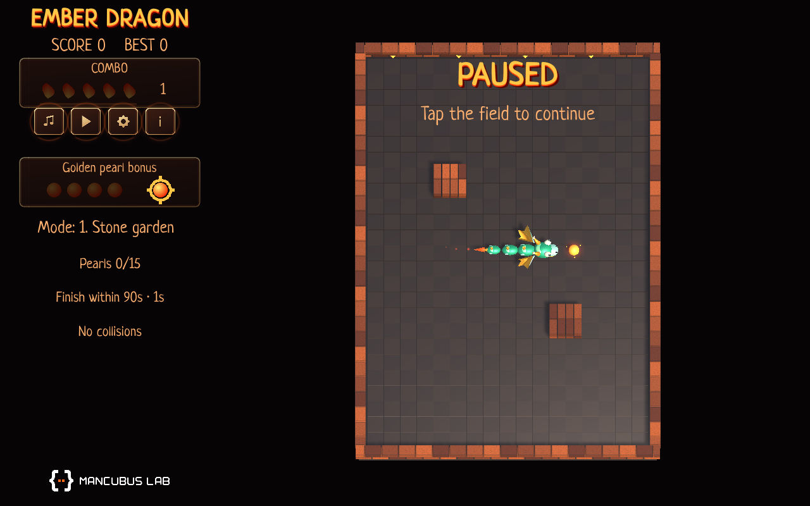
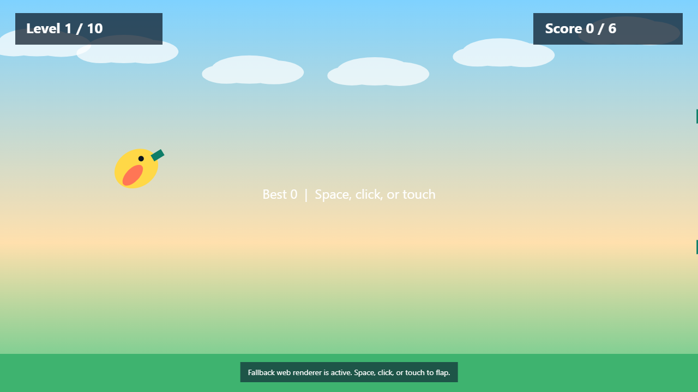

  <picture>
    <source media="(prefers-color-scheme: dark)" srcset="assets/logo-dark.svg">
    <source media="(prefers-color-scheme: light)" srcset="assets/logo-light.svg">
    
  </picture>

<strong>Small games. Playful experiments.</strong> 
Building games and interactive experiments with Unity and C#.

Unity &nbsp; / &nbsp; C# &nbsp; / &nbsp; Android &nbsp; / &nbsp; WebGL &nbsp; / &nbsp; Procedural graphics

## Featured projects

<table>
<tr>
<td width="50%" valign="top">

### Ember Dragon

A dragon-themed snake arcade game for Android and WebGL. Play Classic or a 10-level campaign, collect fire pearls, build combos, dash, and use shields and magnets. Earn stars, improve your campaign rating, and evolve your emerald dragon.

**Unity · C# · Android · WebGL · English / Russian**

**Status:** Android 1.0 is in Google Play internal testing. The refreshed WebGL build has been checked in Chrome for keyboard play, pause, and campaign entry.

[Project repository (private)](https://github.com/mancubus-lab/snake-3d-unity) · [Local Web build instructions (access required)](https://github.com/mancubus-lab/snake-3d-unity#web-development-build)

</td>
<td width="50%" valign="top">

### Fluppy Bird

A colorful arcade project with ten difficulty levels, saved best scores, and keyboard, mouse, and touch controls.

**Unity · C# · WebGL / HTML5 fallback**

[Source code](https://github.com/mancubus-lab/fluppy-bird-unity) · [Run locally](https://github.com/mancubus-lab/fluppy-bird-unity#run-locally)

</td>
</tr>
</table>

Previews captured from local builds. Ember Dragon shows the refreshed WebGL campaign on September 25, 2026. Fluppy Bird shows the HTML5 fallback. Public browser demos are not available yet.

## In the lab

- **Homelab & Proxmox** — exploring virtualization, self-hosted services, and the infrastructure behind a connected home.
- **Home Assistant & home automation** — bringing devices, sensors, and everyday routines together into a home that works smarter.
- **Unity & creative coding** — experimenting with procedural visuals, playful mechanics, and small browser games.
