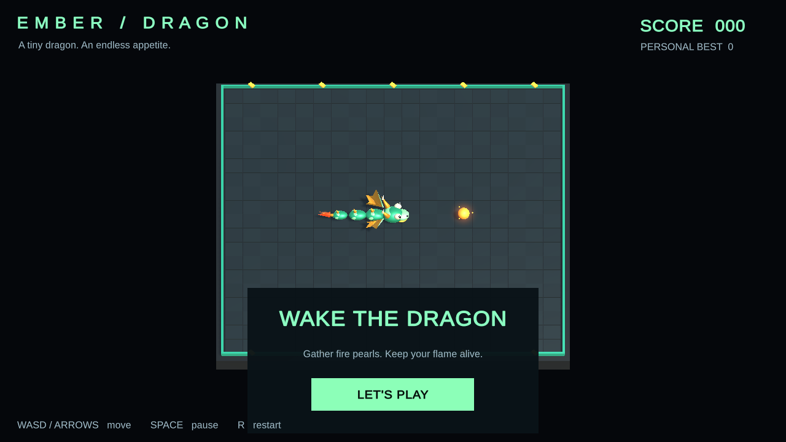

  <picture>
    <source media="(prefers-color-scheme: dark)" srcset="assets/logo-dark.svg">
    <source media="(prefers-color-scheme: light)" srcset="assets/logo-light.svg">
    
  </picture>

<strong>Small games. Playful experiments.</strong> 
Building games and interactive experiments with Unity and C#.

Unity &nbsp; / &nbsp; C# &nbsp; / &nbsp; WebGL &nbsp; / &nbsp; Procedural graphics

## Featured projects

<table>
<tr>
<td width="50%" valign="top">

### Ember Dragon

A snake-inspired arcade game with an emerald dragon, glowing fire pearls, golden spines, and a flickering flame tail.

**Unity · C# · Procedural 3D**

[Source code](https://github.com/mancubus-lab/snake-3d-unity) · [Run locally](https://github.com/mancubus-lab/snake-3d-unity#build-and-run-locally)

</td>
<td width="50%" valign="top">

### Fluppy Bird

A colorful arcade project with ten difficulty levels, saved best scores, and keyboard, mouse, and touch controls.

**Unity · C# · WebGL / HTML5 fallback**

[Source code](https://github.com/mancubus-lab/fluppy-bird-unity) · [Run locally](https://github.com/mancubus-lab/fluppy-bird-unity#run-locally)

</td>
</tr>
</table>

Previews captured from local builds. Fluppy Bird shows the HTML5 fallback. Public browser demos are not available yet.

## In the lab

- Exploring procedural visuals, character animation, and responsive game feel.
- Building small browser games and learning through playable prototypes.
- Sharing source code, experiments, and progress as the projects evolve.
